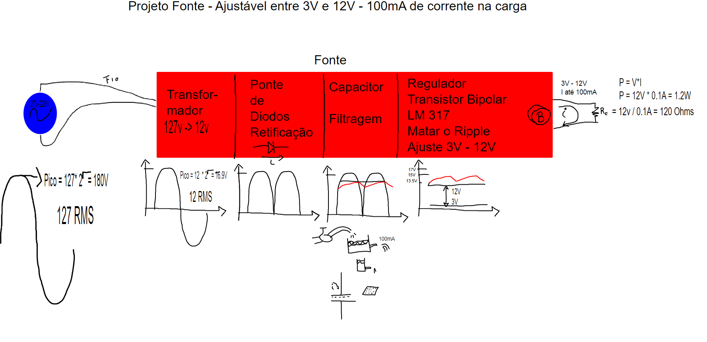
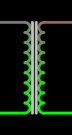
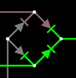
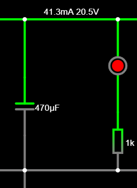
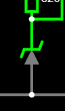
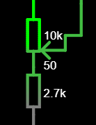
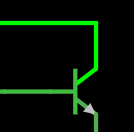
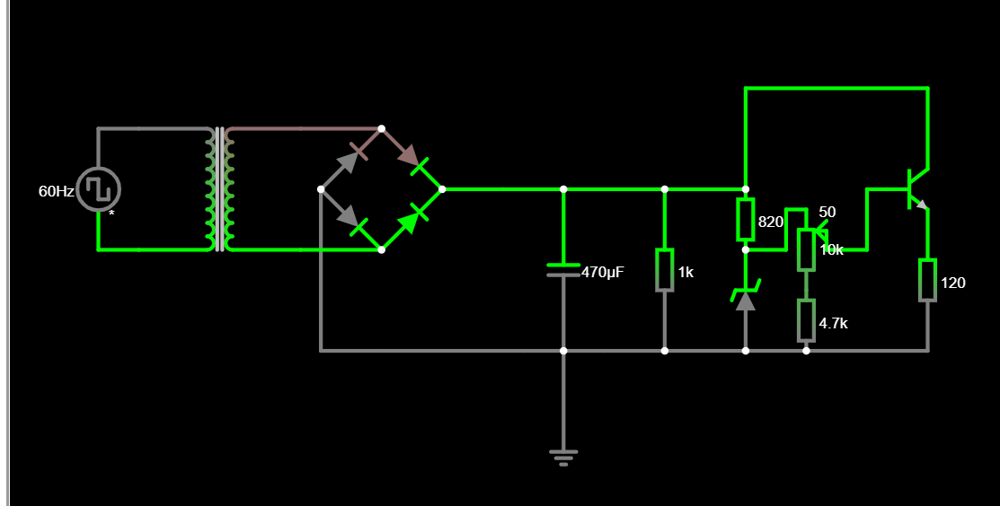
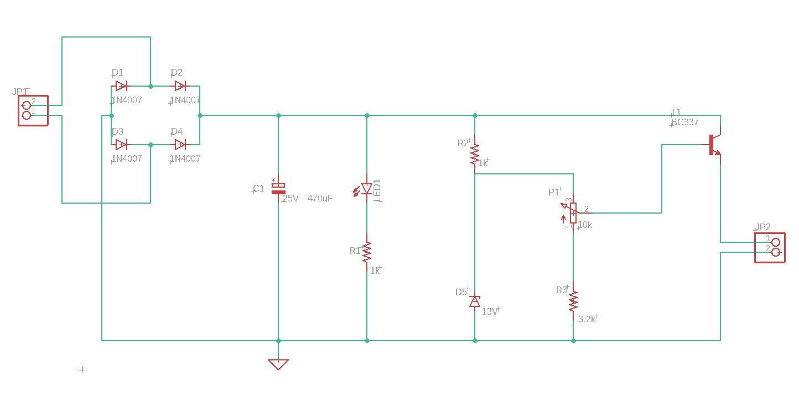
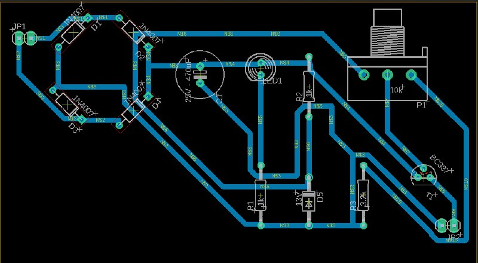

# Fonte_tensao_variavel

Trabalho do projeto do professor Simões

## Lista de componentes escolhidos para o trabalho
* **Capacitor**: Capacitor de 25V com 470μF (R$ 1,05) ;
* **Potenciômetro**: Potenciômetro linear de 10k (R$ 7,00) ;
* **Diodo Zenner**: Diodo Zenner de 13V (R$ 0,48) ;
* **Transistor**: Transistor NPN BC337 (R$ 0,69) ;
* **Diodo**: Diodo 1N4007 (10 * R$ 0,20 = R$ 2,00) ;
* **Resistores**:
    * **680 Ohms**: (10 * R$ 0,07 = R$ 0,70),
    * **1k Ohms**: (10 * R$ 0,07 = R$ 0,70),
    * **4,7k Ohms**: (10 * R$ 0,07 = R$ 0,70).

### **Total**: R$ 13,32

### Etapas de construção do circuito:

Planejávamos fazer um projto que cumprisse as seguintes etapas:

Primeiramente, tomando como base as aulas do Simões e os projetos de nosso veteranos, chegamos nesse estado do circuito:

Agora faltava descobrir as especificações de cada um dos componentes.

Primeiramente, a tomada já estava definida como de 110V, faltando agora o transformador:

O transformador tem o papel de reduzir a tensão que entrará no circuito por meio da diferença de voltas nas espiras que tem na entrada e na saída dele, ele gera um campo magnético diferente de cada lado induzindo uma corrente de valor diferente, conseguindo assim alterar também a tensão.

Para esse projeto, nós usamos um que o professor Simões possuía que era capaz de gerar uma saída de 24 V a partir de uma entrada de 110V.

Agora a ponte de diodos:

A ponte de diodos tem a função de retificar a tensão. Como a tomada possui corrente alternada, a DDP fica alternando entre positiva e negativa, mas por meio da ponte de diodos, conseguimos fazer com que ela seja sempre positiva.

Agora o capacitor:

O capacitor funciona como uma caixa d'água, ele armazena carga quando entra corrente nele e libera quando não estiver entrando, assim, por meio dele, conseguimos que a senoidal da tensão se torne mais linear, pois quando a tensão estaria em processo de queda, ele fornece energia esstabilizando a tensão para o resto do circuito. Mesmo assim, ainda sobram algumas pequenas "ondinhas", e nesse projeto queremos que a tensão fique estável. Queríamos um Ripple de cerca de 10%, que com os nossos cálculos precisava de um capacitor de ...uF, e por isso escolhemos um de 470uF que é o disponível comercialmente próximo a esse valor. Nesse circuito também colocamos um Led para ele acender e termos certeza de que estava tudo funcionando.

Agora o Diodo Zenner:

O diodo Zenner tem a função de regular a tensão máxima. Ele só permite a passagem de corrente quando esta atinge sua tensão nominal e ele barra a passagem de uma tensão maior que a nominal. Assim, por meio dele, conseguimos retificar perfeitamene a tensão que sobou do capacitor(ripple). Nesse projeto utilizamos um zenner de 13V para ter uma margem de erro em relação aos 12V que desejamos.

Agora o potenciômetro:

O potenciômetro é um resistor variável e, por meio dele, conseguiremos mudar também a tensão entre 12V e 3V. Nesse projeto utilizamos um potenciômetro de 10k.

Agora o transistor:

O transistor foi conectado de uma maneira"errada", de tal forma que ele só permite a passagem de corrente quando a diferença ddp entre a saída e o potenciômetro for de pelo menos 0,7V. Por meio dele, nós conseguimos fazer com que a alteração da ddp no potenciômetro afete também a saída.

E assim, chegamos no seguinte circuito

# Cálculos

Como queremos um Ripple pequeno(10%), podemos usar a fórmula simplificada C = i / (f * v)

Com base no simulador Falstad, encontramos a tensão após a ponte de diodos de V e a corrente depois do capacitor de A. Agora, como já temos a fonte como corrente alternada de 60Hz, temos que f será 2 * 60 = 120Hz, só falta é usar a fórmula.

# Link do Falstad

[Falstad](https://tinyurl.com/2ydd5g95)

# Imagem esquemático da PCB

# Imagem PCB no programa Proteus

# Link do vídeo

# Alunos

Artur De Vlieger Lima

Calebe Damas Nogueira

Gabriel Souza Santos de Almeida

Lucas Vizzotto de Castro

# Avisos
Mudamos o valor do resistor de 2.7k para 3.2k por que não achamos o de 2.7k.
