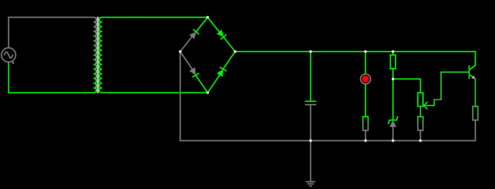

# Fonte_tensao_variavel

Trabalho do projeto do professor Simões

## Lista de componentes escolhidos para o trabalho
* **Capacitor**: Capacitor de 25V com 470μF (R$ ) ;
* **Potenciômetro**: Potenciômetro linear de 10k (R$ ) ;
* **Diodo Zenner**: Diodo Zenner de 13V (R$ ) ;
* **Transistor**: Transistor NPN BC337 (R$ ) ;
* **Diodo**: Diodo 1N4007 (R$ ) ;
* **Resistores**: Resistores de 680, 4,7k, e 1k (R$ ) .

### Representação do circuito da fonte no Falstad:

| Eu | Aprendi | a fazer | tabela|
| apenas| sucesso | tcc em | readme |
